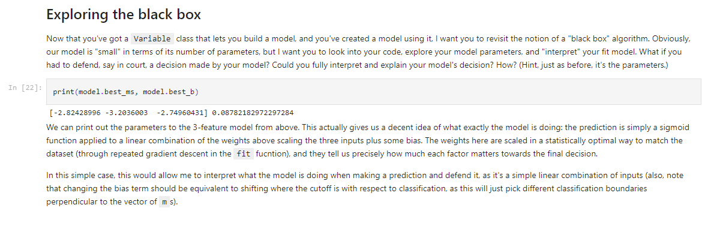

# CSC 630: Machine Learning - Final Reflection by William Yue

## Table of Contents

1. [Learning Objective Subcategories](#learning-objective-subcategories)
2. [Learning Objective 1](#learning-objective-1-i-can-use-the-tools-of-the-pydata-stack-to-understand-interpret-and-visualize-datasets-including-making-arguments-about-its-underlying-distributions)
3. [Learning Objective 2](#learning-objective-2-i-can-implement-and-describe-the-use-of-all-aspects-of-the-data-modeling-process)
4. [Learning Objective 3](#learning-objective-3-i-can-use-ethical-reasoning-to-empower-my-data-decisions-ensuring-that-the-technical-work-that-i-do-promotes-equity-and-justice)
5. [Learning Objective 4](#learning-objective-4-i-can-tell-stories-with-data-both-by-discussing-my-process-in-shapingmanipulatingmodeling-it-and-the-choices-made-to-do-so-and-through-making-arguments-about-what-my-findings-say-about-the-world)
6. [Overall Grade](#overall-grade)
7. [Additional Reflection](#additional-reflection)

## Learning Objective Subcategories

The four subcategories for each learning objective:

### Organization

* Is your work toward this learning objective readable? (For example, are the cells of your notebook in the same order as the intended kernel order? Is your writing polished and self-edited?)
* Are explanations of code, visualizations, and other artifacts of work clearly and consistently associated with their artifact?
* Is your work polished?

### Volume of Work

* Do you have work done in multiple formats toward this learning objective?
* How much work has been put towards each learning objective? (*Dr. Z might rephrase as, "Have you done what should be considered sufficient work toward this LO, given that this is a 600-level class?"*)
* Have you incorporated aspects of this learning objective into many projects/assignments?
* Have you learned about multiple aspects/viewpoints about the LO's topics?

### Analysis/Documentation

* Do you present and substantiate compelling arguments toward this LO?
* Does your code documentation assist in providing *clarity* in your work toward your LO?
* Do your writing and your code documentation provide a *complete* explanation of your work toward this LO?  

### Progress

* Do you have evidence that your skill level and understanding of this LO has improved?
* Have you leveraged (*and cited*) resources to expand your knowledge of this LO? Have you asked questions of your teachers/peers to do so?
* Have you looked at credible sources from both in and outside of class about this LO’s topics?

## Learning Objective 1: I can use the tools of the PyData stack to understand, interpret, and visualize datasets, including making arguments about its underlying distributions.

* **Organization:** 3.0/3
* **Volume of Work:** 3.0/3
* **Analysis/Documentation:** 3.0/3
* **Progress:** 3.0/3

The majority of my work involving datasets and the PyData stack are in four different Jupyter Notebooks: 

* [The Pydata Stack Lab](https://github.com/willwin4sure/CSC_630_Machine_Learning/blob/main/pyData/PyData_Stack_Lab.ipynb)
* [Sentiment 140 Dataset Preprocessing](https://github.com/willwin4sure/CSC_630_Machine_Learning/blob/main/BERT/sentiment140_dataset.ipynb)
* [Data Pre-Processing for Predicting Myers Briggs Types](https://github.com/bharnav/CSC630-Machine-Learning/blob/main/Predicting%20Myers%20Briggs%20Types/data%20pre-processing/data_pre_processing.ipynb), with *Arnav Bhakta*
* [Exploring and Pre-Processing the Chess Dataset](https://github.com/willwin4sure/CSC_630_Machine_Learning/blob/main/ChessAI/exploring_prepocessing_dataset.ipynb)

I already covered a lot of my work in the first three Jupyter notebooks already in my [Midterm Reflection](https://github.com/willwin4sure/CSC_630_Machine_Learning/blob/main/Reflections/midterm_reflection.md), so I will avoid writing extensively about them here; instead, I will try to focus on my work from after the midterm.

For my chess bot project with *Davin Jeong* and *Ali Yang*, we're working with this [Kaggle Chess Dataset](https://www.kaggle.com/ronakbadhe/chess-evaluations) by Ronak Badhe. I explored this dataset in this Jupyter notebook: [Exploring and Pre-Processing the Chess Dataset](https://github.com/willwin4sure/CSC_630_Machine_Learning/blob/main/ChessAI/exploring_prepocessing_dataset.ipynb). Like all of my other Jupyter notebooks, this one is designed in the intended kernel order. Indeed, if you try running `Cell >> Run All`, it should work as intended (assuming that all the necessary dependencies are installed).

In order to start exploring this dataset, I first printed the first few columns:

    

When I first encountered this, I wasn't quite sure what FEN was, so I did some research on it and explained it in the Jupyter notebook. It turns out that FEN stands for Forsyth-Edwards Notation. In general, a FEN string looks something like `rnbqkbnr/pppppppp/8/8/4P3/8/PPPP1PPP/RNBQKBNR b KQkq e3 0 1`. After doing some research (e.g. using this [Wikipedia article](https://en.wikipedia.org/wiki/Forsyth%E2%80%93Edwards_Notation)), I was able to determine all the different components of the FEN string (the last two numbers in the string I decided to ignore: one is the number of half moves since the last capture or pawn advance, only applicable for edge-case draws, and the other is the number of full moves since the start of the game). In the images below, I give complete, organized, and detailed explanations for everything I learned about the dataset, interspersed with some code interacting with the [`python-chess` library](https://python-chess.readthedocs.io/en/latest/).

    

    

    

I also employ ample use of `matplotlib.pyplot` (and previously `seaborn`, e.g. in my [PyData Stack Lab](https://github.com/willwin4sure/CSC_630_Machine_Learning/blob/main/pyData/PyData_Stack_Lab.ipynb)) to make plots and visualizations. For example, when exploring the other column of the dataset, after writing some code that filters out checkmate positions and converts the centipawn advantages into pawn advantages, I plotted them using `plt.hist`, as below:

    

Given that I before the class, I had limited exposure to `numpy` and `matplotlib.pyplot` and had never head of `pandas`, `seaborn`, or Jupyter notebooks before, I'd say my skills in working with the PyData Stack to analyze datasets has grown significantly. In addition, whenever I encounter issues, I leverage the tools around me, checking online documentation (with citation by linking them in my Jupyter notebook, e.g. at the top of my [Gradients Project](https://github.com/willwin4sure/CSC_630_Machine_Learning/blob/main/Gradients_Project/project_gradients.ipynb) I had a long list of sources) or consulting my peers like *Arnav Bhakta*, *Ali Yang*, *Michael Huang*, or *Davin Jeong* to help me resolve the issue.

Even though working with large multidimensional data wasn't a main component of my post-midterm work on the chess bot, I still demonstrated proficiency in analyzing and visualizing datasets, and my prior work in [The PyData Stack Lab](https://github.com/willwin4sure/CSC_630_Machine_Learning/blob/main/pyData/PyData_Stack_Lab.ipynb), [Sentiment 140 Dataset Preprocessing](https://github.com/willwin4sure/CSC_630_Machine_Learning/blob/main/BERT/sentiment140_dataset.ipynb), and [Data Pre-Processing for Predicting Myers Briggs Types](https://github.com/bharnav/CSC630-Machine-Learning/blob/main/Predicting%20Myers%20Briggs%20Types/data%20pre-processing/data_pre_processing.ipynb) as described in my [Midterm Reflection](https://github.com/willwin4sure/CSC_630_Machine_Learning/blob/main/Reflections/midterm_reflection.md) are indicative of excellence in this learning objective.

* **Total:** 12.0/12

## Learning Objective 2: I can implement and describe the use of all aspects of the data modeling process.

* **Organization:** 3.0/3
* **Volume of Work:** 3.0/3
* **Analysis/Documentation:** 3.0/3
* **Progress** 3.0/3

In my [Midterm Reflection](https://github.com/willwin4sure/CSC_630_Machine_Learning/blob/main/Reflections/midterm_reflection.md), I focused on my work in 
* Constructing a Twitter sentiment dataset using the Twitter API
* Pre-processing datasets for training
* Creating automatic differentiation through the Variable class in [`variable.py`](https://github.com/willwin4sure/CSC_630_Machine_Learning/blob/main/Gradients_Project/variable.py) of the Gradients Project
* Implementing logistic regression in [`logistic_regression.py`](https://github.com/willwin4sure/CSC_630_Machine_Learning/blob/main/Gradients_Project/logistic_regression.py) of the Gradients Project

In this Final Reflection, I will be focusing on my work post-midterm reflection, which was on the entire process of building a chess bot. Loosely, I will go through all of my files in the [CarissaBot repo model folder](https://github.com/huskydj1/CarissaBot/tree/main/model). I also created the entirety of the [Python version](https://github.com/huskydj1/CarissaBot/tree/main/python_version) of running the bot against a player (a messier version can be found in my [CSC 630 Repository](https://github.com/willwin4sure/CSC_630_Machine_Learning/tree/main/ChessAI)).

**Sidenote:** The committer of many Python files in the [CarissaBot repo model folder](https://github.com/huskydj1/CarissaBot/tree/main/model) is listed as Ali (*Christine Yang*), but this is simply because I was working using her remote server so I could train on the multiple GPUs that she has (thanks a lot to her for letting me use them!). While she certainly helped with many parts of the project, **almost all of the written code is my own** (plenty is just ported over from my own (messy) [CSC 630 Repository](https://github.com/willwin4sure/CSC_630_Machine_Learning/tree/main/ChessAI)). I will cite others if I refer to any of their code snippets in this reflection.

### Creating a dataset for chess

Though we ended up using this [Kaggle Chess Dataset](https://www.kaggle.com/ronakbadhe/chess-evaluations) by Ronak Badhe, I did play aroung with trying to create my own. My main goal to to expand the size of `random_evals.csv` from the Kaggle dataset, since I thought it would be helpful for the bot to get more examples of what moves not to play during the game. In [`data_generation.py`](https://github.com/huskydj1/CarissaBot/blob/main/model/data_generation.py), I started the process of creating such a dataset by downloading Stockfish off the [internet](https://stockfishchess.org/download/) and using it to evaluate chess positions. However, I realized to generate a dataset as large as `random_evals.csv` of 1 million positions, I would need at least 1 million seconds if I let Stockfish compute for 1 second on each position (ideally, I would let it train for even more). Sadly, this would take over a day to generate, a bit too much for the amount of time I had left.

### Pre-processing and manipulating the chess dataset for training, including construction of a custom `ChessDataset` PyTorch class for training the model

I also did a lot of work in pre-processing and manipulating chess datasets in these Python file: [`data_manip.py`](https://github.com/huskydj1/CarissaBot/blob/main/model/data_manip.py) and [`slice_dataset.py`](https://github.com/huskydj1/CarissaBot/blob/main/model/slice_dataset.py), as well as work in creating my own custon PyTorch chess dataset in [`chess_dataset.py`](https://github.com/huskydj1/CarissaBot/blob/main/model/chess_dataset.py). 

[`slice_dataset.py`](https://github.com/huskydj1/CarissaBot/blob/main/model/slice_dataset.py) simply consists of a way of randomly sampling from the large size 12 million `chessData.csv` data that we're using, and then append it to the `random_eval.csv` data (both of these files are from the [Kaggle chess dataset](https://www.kaggle.com/ronakbadhe/chess-evaluations) that we're using). This was necessary since the full dataset takes too long to load and train on.

[`data_manip.py`](https://github.com/huskydj1/CarissaBot/blob/main/model/data_manip.py) starts with a few helper methods that convert the centipawn advantage to pawn advantage, while filtering out checkmates by turning them into extreme advantage, and also a method which converts pawn advantage to and from winning probability using the formula in this [page](https://www.chessprogramming.org/Pawn_Advantage,_Win_Percentage,_and_Elo). The main part of the file, however, is converting the [FEN strings](https://en.wikipedia.org/wiki/Forsyth%E2%80%93Edwards_Notation) in the dataset into a piece-centric [bitboard](https://www.chessprogramming.org/Bitboards) [board representation](https://www.chessprogramming.org/Board_Representation) which we can feed into the model, based off of some of the work in this [notebook](https://www.kaggle.com/ronakbadhe/chess-evaluation-prediction).

    

This encoding consists of 29 layers of 8x8 arrays of bits. The first layer is all 1s or all 0s based on whether it's white or black's move. The next 12 layers encode each of the 12 piece types (pawn, knight, bishop, rook, queen, king of two colors) and has a 1 whereever there is a piece of that type on the board and a 0 everywhere else (for example, at the start of the game, the layer corresponding to white pawns should have 8 1's on the 2nd rank of the board). The next 12 layers encode the attack maps of these pieces, marking all the squares that can be attacked by the pieces in the corresponding layer. Finally, the last four layers encode castling rights (one for each of white/black king/queen side castling), with all 1s if legal and all 0s if illegal. This representation of the board can then be passed into the neural network.

I also created a `ChessDataset` custom PyTorch class with help from *Ali Yang* in [`chess_dataset.py`](https://github.com/huskydj1/CarissaBot/blob/main/model/chess_dataset.py), which reads the data, applies the necessary preprocessing, caches the loaded data, and allows us to interact nicely with the data, e.g. with DataLoaders.

    

### Defining the architecture of the model, based off of LeelaChessZero's network topology

The neural network architecture is based on [Leela Chess Zero's network topology](https://lczero.org/dev/backend/nn/). You can find a print out of the entire network with parameters `blocks=8` (8 residual blocks in the middle) and `filters=64` (number of channels in hidden layers) here [here](https://github.com/huskydj1/CarissaBot/blob/main/model/architecture.txt), which is what is outputted when you run the [`model.py`](https://github.com/huskydj1/CarissaBot/blob/main/model/model.py) file. At this size, the model has `941153` parameters.

Here's a more detailed explanation of the architecture defined in [`model.py`](https://github.com/huskydj1/CarissaBot/blob/main/model/model.py), where all convolutions below have `kernel_size=1` and `stride=1`:
* Start with the input board representation, which consists of 29 channels of 8x8 bits, as discussed above. Run an input convolution to size `filters`x8x8. Then perform a standard batch normalization.
* Tower of `blocks` residual blocks:
    * Convolution from `filters`x8x8 to `filters`x8x8. Then perform a standard batch normalization.
    * Convolution from `filters`x8x8 to `filters`x8x8. Then perform a standard batch normalization.
    * A [squeeze and excitation block](https://arxiv.org/abs/1709.01507) (SE Block), which consists of:
        * A global average pooling layer from `filters`x8x8 to `filters`
        * A fully connected layer from `filters` to `se_channels=32`
        * ReLU
        * A fully connected layer from `se_channels` to 2x`filters`
        * 2x`filters` split into two `filter`-sized vectors `w` and `b`
        * Sigmoid on `w`
        * Output of SE block is `w * (input to SE) + b`
    * Residual tower skip connection
    * ReLU activation

My impression of the point of the SE block is that it allows the model to capture global information of the board, rather than just local information from the convolutional layers. In addition, it allows you to *multiply* inputs in a way that's not possible with other layers (most other layers are just some sort of linear combination with activation, but the multiplication of `w` and the `input to SE` is a different type of function).

The main class is defined here:

    

Residual blocks and SE layers were previously defined in the file here:

    

    

Most of this work was pretty straightforward, but the hardest part was probably constructing the SE layer, where there's no pre-build `torch.nn` module which performs the necessary operation. Instead, in the `forward` method, I had to slice `w = y[:, 0:self.filters, :, :]` and `b = y[:, self.filters:2*self.filters, :, :]` before fixing dimensions to scale and add: `return x * w.expand_as(x) + b.expand_as(x)`.

### Writing the training loop for the model

This all occurs in the [`train.py`](https://github.com/huskydj1/CarissaBot/blob/main/model/train.py) file. We start by loading the dataset and model from where they were previously defined in files, splitting the data into 80% training and 20% validation, and then defining DataLoaders for batching the data. The code using multiple GPUs and using DataParallel was written by *Ali Yang*.

    

Then, we train the model using MSE loss and the AdamW optimizer (with `tqdm` for nice progress bars!). We also apply gradient clipping using `torch.nn.utils.clip_grad_norm_(model.parameters(),1)` to prevent exploding gradients in deep models. Finally, we print out the training loss each epoch.

    

During this training loop, we also evaluate the model as shown below, printing out the loss on the validation dataset. Finally, we save the model every 5 epochs to a `.pt` file.

    

### Loading the model and running it as the evaluation heuristic at the bottom of an alpha-beta tree search

All this work appears in this [folder](https://github.com/huskydj1/CarissaBot/tree/main/python_version), especially in the [`bot_player.py`](https://github.com/huskydj1/CarissaBot/blob/main/python_version/bot_player.py) file. 

Indeed, I wrote my own Python version of the alpha-beta pruning algorithm (*Davin Jeong* wrote the C++ version, which is still under production) below.

    

Note that at the bottom of the tree, the search calls the `predict_model` function, which loads the model from a `.pt` file and runs the board representation through it. The weird code within the `for key in list(sdict.keys()):` loop was provided by *Ali Yang*, and is necessary since we were training using DataParallel on 4 GPUs.

    

Finally, I also tested out many different hyperparameters for the model: its size, the learning rate, the number of epochs, as well as figuring out what dataset to train it on for the best results. I noticed that `random_evals.csv` was very necessary for the model to learn what moves are really terrible, and that a 8x64 model does comparably to a 10x128 model, but reducing the size to 6x50 caused a large drop in performance. I also made some nice plots of the training and test (actually, validation) losses during training:

    

Overall, I've done a ton of work in this Chess AI project, and combined with my previous work described in my [Midterm Reflection](https://github.com/willwin4sure/CSC_630_Machine_Learning/blob/main/Reflections/midterm_reflection.md), I've definitely excelled in volume of work, organization, and documentation. In addition, I often ask the people around me for help: *Ali Yang* was greatly helpful in helping me with PyTorch, and I consulted *Michael Huang* with some questions about the neural network architectures, in particular where I should put the skip connections. And of course, I worked closely on and discussed with *Davin Jeong* the alpha-beta pruning tree search part of the algorithm, and we've been working on converting the model into C++.

* **Total:** 12.0/12

## Learning Objective 3: I can use ethical reasoning to empower my data decisions, ensuring that the technical work that I do promotes equity and justice.

* **Organization:** 2.8/3
* **Volume of Work:** 2.2/3
* **Analysis/Documentation:** 2.6/3
* **Progress** 2.8/3

Like in my [Midterm Reflection](https://github.com/willwin4sure/CSC_630_Machine_Learning/blob/main/Reflections/midterm_reflection.md), this is my weakest learning objective, mainly because I devoted most of my time post-midterm reflection working on the technical aspects of the chess AI project. However, I still found areas of ethical reasoning I could talk about: my initial **Boston Housing Dataset** reflection, my discussion of black boxes in the **Gradients Project**, and finally how black boxes and model interpretability play into my chess AI.

My main work this term for this learning objective is reflecting on ethical problems within the **Boston Housing Dataset**. First, I gave an analysis on what I learned from this [article](https://medium.com/@docintangible/racist-data-destruction-113e3eff54a8) in [The PyData Stack Lab](https://github.com/willwin4sure/CSC_630_Machine_Learning/blob/main/pyData/PyData_Stack_Lab.ipynb), as below:

    

In addition, I thought a bit more about the Boston Housing Dataset for a homework assignment and wrote up my thoughts in a [Reflection on Boston Housing Dataset Ethics](https://github.com/willwin4sure/CSC_630_Machine_Learning/blob/main/pyData/Boston_Housing_Reflection.md), previously described in my [Midterm Reflection](https://github.com/willwin4sure/CSC_630_Machine_Learning/blob/main/Reflections/midterm_reflection.md).

Aside from the Boston Housing Dataset, I also analyzed the ethics of black box algorithms as part of the [Gradients Project](https://github.com/willwin4sure/CSC_630_Machine_Learning/tree/main/Gradients_Project), particularly in this [Jupyter notebook](https://github.com/willwin4sure/CSC_630_Machine_Learning/blob/main/Gradients_Project/project_gradients.ipynb). Much of this ethical reflection that I wrote below expands on what I had written by the midterm reflection.

    

In addition, I also provided some reflections on black boxes at the end of the Gradients Project.

    

Finally, I believe the problem of black boxes and model interpretability is quite relevant for the chess AI project. The neural network architecture based on [Leela Chess Zero's network topology](https://lczero.org/dev/backend/nn/) is quite complicated. You can find a print out of the entire network here [here](https://github.com/huskydj1/CarissaBot/blob/main/model/architecture.txt), which is what is outputted when you run the [`model.py`](https://github.com/huskydj1/CarissaBot/blob/main/model/model.py) file. This size of the model, where `blocks=8` and `filters=64` (referred to as 8x64), is quite small compared to what Leela Chess Zero recommends, and it has exactly `941153` parameters (the code to compute this is also in [`model.py`](https://github.com/huskydj1/CarissaBot/blob/main/model/model.py)). However, we chose to use it over a 10x128 model (which has `3415713` parameters) since it had comparable performance but ran twice as quickly (which would allow for greater search depth faster). 

However, the large size and complicated nature of this model makes it a bit of a black box, but I'm fine with this since chess is a complicated game that would probably require this amount of complexity to solve (in fact, Leela Chess Zero recommends using a 20x256 model or bigger for deeper understanding of the game). Nonetheless, I did consider trying more interpretable models such as combining manually extracted high level features from the position (e.g. material, pawn structure, king safety), etc. and passing those into the model, and then checking which of these it found the most salient in each position/how the model combined each of them. Material calculation could even be a bit more complicated, where you assign a value for each piece also based on its position, and you could view the weights of any piece on any square (maybe the computer values pawns that are further advanced on the board or pieces that are closer to the center of the board). However, I didn't like the idea of manually extracting features, since it didn't feel in the spirit of applying neural networks to chess, where I feel like we should try to stay away from the feature extraction approach of many standard chess bots. In any case, this application of neural networks isn't on any high-stakes decisions, but I can see now how black boxes can be challenging to interpret and lead to potentially biased decisions for important matters.

Overall, I'd say my writing is pretty well organized and documented, and I provide good analyses. I've also leveraged online resources when it comes to researching about ethical issues, as well as the students around me (talking to *Arnav Bhakta* or *Carissa Yip*). However, my overall volume of work for this learning objective isn't that high, so I've graded myself appropriately with that in mind.

* **Total:** 10.4/12

## Learning Objective 4: I can tell stories with data, both by discussing my process in shaping/manipulating/modeling it and the choices made to do so, and through making arguments about what my findings say about the world.

* **Organization:** 3.0/3
* **Volume of Work:** 3.0/3
* **Analysis/Documentation:** 2.8/3
* **Progress** 3.0/3

Most of my storytelling occurs in the following five Jupyter notebooks:
* [The Pydata Stack Lab](https://github.com/willwin4sure/CSC_630_Machine_Learning/blob/main/pyData/PyData_Stack_Lab.ipynb)
* [Sentiment 140 Dataset Preprocessing](https://github.com/willwin4sure/CSC_630_Machine_Learning/blob/main/BERT/sentiment140_dataset.ipynb)
* [LSTM Model for Predicting Myers Briggs Personality Types](https://github.com/bharnav/CSC630-Machine-Learning/blob/main/Predicting%20Myers%20Briggs%20Types/models/myers-briggs-data_0-lstm.ipynb), with *Arnav Bhatka*
* [Exploring and Pre-Processing the Chess Dataset](https://github.com/willwin4sure/CSC_630_Machine_Learning/blob/main/ChessAI/exploring_prepocessing_dataset.ipynb)
* [PyTorch Tutorial](https://github.com/willwin4sure/CSC_630_Machine_Learning/blob/main/Learn_PyTorch/PyTorch%20Tutorial.ipynb)

I already discussed the first three in my [Midterm Reflection](https://github.com/willwin4sure/CSC_630_Machine_Learning/blob/main/Reflections/midterm_reflection.md), so I will focus on the bottom two here.

In my [Exploring and Pre-Processing the Chess Dataset](https://github.com/willwin4sure/CSC_630_Machine_Learning/blob/main/ChessAI/exploring_prepocessing_dataset.ipynb) Jupyter notebook, I tell a story about examining this chess dataset and understanding each component: all aspects of the FEN strings and also how the evaluations are stored: I talked through all of my reasoning and exploration:

    

    

    

I also documented my thought processes in using `random_evals.csv`, as it gives the model more information about what moves really suck, and also in not using `tactic_evals.csv`, since we want the model to have a better high-level heuristic view of which positions are good, instead of focusing on sharp tactical combinations: these sorts of tactics would be better handled by the tree search portion of the bot:

    

In the image above, I also talked about how I plotted the evaluations in a histogram and why the data seemed symmetric and nice enough for me to work with, especially after I apply the sigmoid function of converting pawn advantage to win probability (this is good, since +7 and +10 are quite close in evaluation, both very winning for white, while -1 and +2 are much much more different, so the sigmoid accounts for this.)

In my [PyTorch Tutorial](https://github.com/willwin4sure/CSC_630_Machine_Learning/blob/main/Learn_PyTorch/PyTorch%20Tutorial.ipynb) Jupyter notebook, I go through all my though processes of learning how PyTorch works: an example is below where I explain what I've learned about the `DataLoader` and `Dataset` classes as well as my process in loading the FashionMNIST dataset. 

    

I document what I do in markdown cells before I do it in the actual code cells, telling a story of working with this dataset throughout the tutorial.

    

    

The work that I've shown above combined with my efforts described in my midterm reflection show that I've done a lot of work in telling stories with data in an organized fashion. Similar to all the other learning objectives, I consult online documentation (or in the case of the PyTorch tutorial, I am ltierally working off of documentation) or friends to help me solve any problems I encounter. Given that I had no experience at the start of the class with telling stories about data, I have progressed greatly in this learning objective.

* **Total:** 11.8/12

## Overall Grade
`(12+12+10.4+11.8)/48=46.2/48=96.3%`

## Additional Reflection

* Suppose you could travel back in time to the start of the term to give your 10-weeks-ago-self some advice for success in this course. What advice would you give yourself? How do you feel you did at adhering to this advice?

There's not actually much time in the term to work on your projects! 10 weeks is already a short time, and the first half of the term is dedicated to learning Python, basics of the PyData Stack and machine learning, and working on the gradients project (all of which was a great experience, of course), but this doesn't actually leave much time in the open-ended portion of the course. You should try to choose a project or two that is reasonable to fit into a 3 week period. But also, since the class is so open-ended, definitely pick something you'll truly enjoy working on. Future you picked working on a chess AI, which was really fun to devote time to, even if it didn't turn out particularly successful. 

Also, work hard to leverage the resouces around you. This class is a wonderful opportunity to learn a lot of things: you have the potential to transform from someone with very limited experience with Python and machine learning to someone who feels competent in many tools in the field, be it the PyData Stack of `numpy`, `pandas`, `matplotlib.pyplot`, etc. or PyTorch!