# CSC 630: Machine Learning - Midterm Reflection by William Yue

## Table of Contents

1. [Learning Objective Subcategories](#learning-objective-subcategories)
2. [Learning Objective 1](#learning-objective-1-i-can-use-the-tools-of-the-pydata-stack-to-understand-interpret-and-visualize-datasets-including-making-arguments-about-its-underlying-distributions)
3. [Learning Objective 2](#learning-objective-2-i-can-implement-and-describe-the-use-of-all-aspects-of-the-data-modeling-process)
4. [Learning Objective 3](#learning-objective-3-i-can-use-ethical-reasoning-to-empower-my-data-decisions-ensuring-that-the-technical-work-that-i-do-promotes-equity-and-justice)
5. [Learning Objective 4](#learning-objective-4-i-can-tell-stories-with-data-both-by-discussing-my-process-in-shapingmanipulatingmodeling-it-and-the-choices-made-to-do-so-and-through-making-arguments-about-what-my-findings-say-about-the-world)
6. [Overall Grade](#overall-grade)
7. [Additional Reflection](#additional-reflection)

## Learning Objective Subcategories

The four subcategories for each learning objective:

### Organization

* Is your work toward this learning objective readable? (For example, are the cells of your notebook in the same order as the intended kernel order? Is your writing polished and self-edited?)
* Are explanations of code, visualizations, and other artifacts of work clearly and consistently associated with their artifact?
* Is your work polished?

### Volume of Work

* Do you have work done in multiple formats toward this learning objective?
* How much work has been put towards each learning objective? (*Dr. Z might rephrase as, "Have you done what should be considered sufficient work toward this LO, given that this is a 600-level class?"*)
* Have you incorporated aspects of this learning objective into many projects/assignments?
* Have you learned about multiple aspects/viewpoints about the LO's topics?

### Analysis/Documentation

* Do you present and substantiate compelling arguments toward this LO?
* Does your code documentation assist in providing *clarity* in your work toward your LO?
* Do your writing and your code documentation provide a *complete* explanation of your work toward this LO?  

### Progress

* Do you have evidence that your skill level and understanding of this LO has improved?
* Have you leveraged (*and cited*) resources to expand your knowledge of this LO? Have you asked questions of your teachers/peers to do so?
* Have you looked at credible sources from both in and outside of class about this LO’s topics?

## Learning Objective 1: I can use the tools of the PyData stack to understand, interpret, and visualize datasets, including making arguments about its underlying distributions.

* **Organization:** 3.0/3
* **Volume of Work:** 3.0/3
* **Analysis/Documentation:** 3.0/3
* **Progress:** 3.0/3

The majority of my work involving datasets and the PyData stack are in three Jupyter Notebooks: 

* [The Pydata Stack Lab](https://github.com/willwin4sure/CSC_630_Machine_Learning/blob/main/pyData/PyData_Stack_Lab.ipynb)
* [Sentiment 140 Dataset Preprocessing](https://github.com/willwin4sure/CSC_630_Machine_Learning/blob/main/BERT/sentiment140_dataset.ipynb)
* [Data Pre-Processing for Predicting Myers Briggs Types](https://github.com/bharnav/CSC630-Machine-Learning/blob/main/Predicting%20Myers%20Briggs%20Types/data%20pre-processing/data_pre_processing.ipynb), with *Arnav Bhakta*

In general, all of these notebooks are designed so that they are ordered in the intended kernel order, and all the writing is polished and edited. In fact, in all of the above Jupyter notebooks, running `Cell >> Run All` works as intended. I also employ ample use of clear graphics and visualizations from `matplotlib.pyplot`.

Indeed, whenever I'm exploring a dataset, I often print the dataset, look at histograms, and make scatter plots. These allow me to make discoveries or confirm hunches. For example, when working with the California Housing Dataset in [The Pydata Stack Lab](https://github.com/willwin4sure/CSC_630_Machine_Learning/blob/main/pyData/PyData_Stack_Lab.ipynb), something I had no knowledge or experience concerning, I analyzed each of the columns by first printing the head of the DataFrame:

    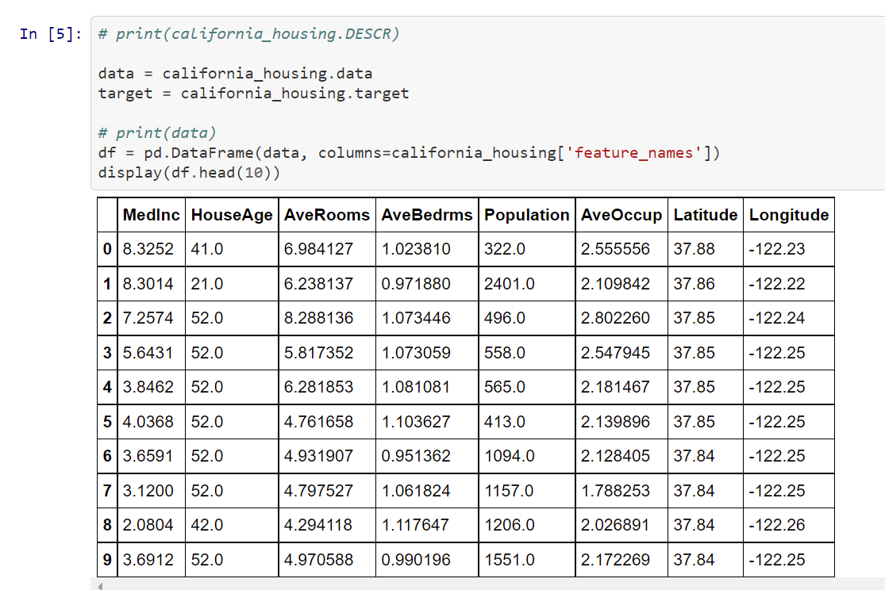

After looking at the data as well as some statistics from `df.describe()`, I usually use `sns.pairlot()` to look for patterns or trends. For example, I spotted that **AveRooms** and **AveBedrms** had a strong positive correspondence/linear relationship. I later confirmed this using a `matplotlib.pyplot` scatter plot and `np.polyfit`:

    <b>AveRooms</b> v. <b>AveBedrms</b> Plot from <a href="https://github.com/willwin4sure/CSC_630_Machine_Learning/blob/main/pyData/PyData_Stack_Lab.ipynb">The PyData Stack Lab</a>
     
    

Here, I utilized visualizations to confirm some of my hunches. I also plotted a histogram of the labels **MedHouseVal**, as below, and discovered that there was a weird cutoff for expensive houses at 5.00001, which was quite curious.

    <b>MedHouseVal</b> Histogram from <a href="https://github.com/willwin4sure/CSC_630_Machine_Learning/blob/main/pyData/PyData_Stack_Lab.ipynb">The PyData Stack Lab</a>
     
    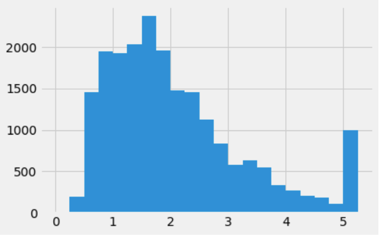

Histograms have also proved useful for my two text preprocessing projects, the [Sentiment 140 Dataset Preprocessing](https://github.com/willwin4sure/CSC_630_Machine_Learning/blob/main/BERT/sentiment140_dataset.ipynb) and [Data Pre-Processing for Predicting Myers Briggs Types](https://github.com/bharnav/CSC630-Machine-Learning/blob/main/Predicting%20Myers%20Briggs%20Types/data%20pre-processing/data_pre_processing.ipynb), in order to determine the maximum length of the samples for a `Tokenizer`. Note that for both these projects, there likely exist some libraries that would perform the pre-processing for me, but I enjoyed getting to work with the more low-level `numpy`, `pandas`, and `re` in order to finish it.

    Histogram of Tweet Lengths from <a href="https://github.com/willwin4sure/CSC_630_Machine_Learning/blob/main/BERT/sentiment140_dataset.ipynb">Sentiment 140 Dataset Preprocessing</a>
     
    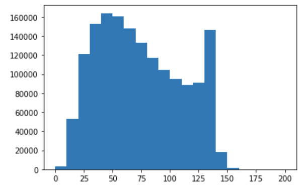

    Histogram of Post Lengths from <a href="https://github.com/bharnav/CSC630-Machine-Learning/blob/main/Predicting%20Myers%20Briggs%20Types/data%20pre-processing/data_pre_processing.ipynb">Data Pre-Processing for Predicting Myers Briggs Types</a>
     
    

Alongside all these graphs and codes, I provide detailed Markdown cells describing my process as well as several comments within the code explaining what I'm doing. For example, in [Data Pre-Processing for Predicting Myers Briggs Types](https://github.com/bharnav/CSC630-Machine-Learning/blob/main/Predicting%20Myers%20Briggs%20Types/data%20pre-processing/data_pre_processing.ipynb), Arnav and I give detailed explanations for what we're doing and why. For example, in the image below, we explain that we'll be using a `Tokenizer` from `keras`, which requires a vocabulary size as well as an `oov_token` to replace words that are "out of vocabulary", before writing out the code for it. 

    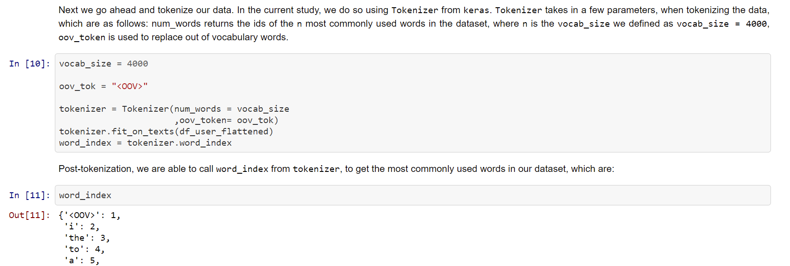

At the top of this file, we give some exposition about MBTI, cite our sources for where we got the information and dataset from, and explain what we're going to do and why. 

    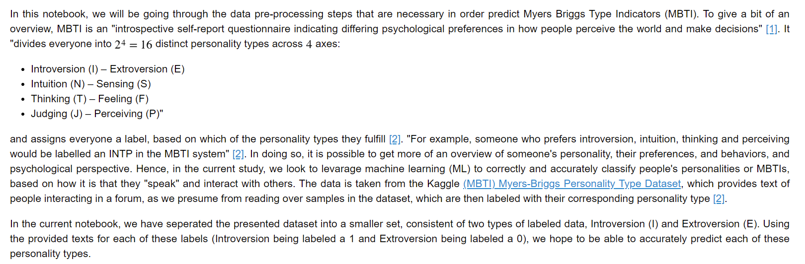

This work ultimately built up to our later work: [LSTM Model for Predicting Myers Briggs Personality Types](https://github.com/bharnav/CSC630-Machine-Learning/blob/main/Predicting%20Myers%20Briggs%20Types/models/myers-briggs-data_0-lstm.ipynb). We also provide in-depth analyses and documentation for this work and cite previous works it builds off of:

    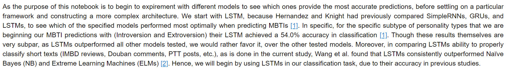

At the start of this term, I had a bit of exposure to `numpy` and `matplotlib.pyplot`, but had never worked with `pandas` DataFrames, datasets, `scikit-learn`, or Jupyter notebooks. My skill in these areas has improved in leaps and bounds. I spend a lot of time consulting documentation, Stack Overflow, or various blog posts (e.g. what is `np.concatenate()`? is `axis=0` joining by rows or columns in a 2d array? how do I draw a red line using `plt`? what the heck are `fig` and `ax`? how do I horizontally slice a DataFrame again?).

I also feel that through my first couple of weeks as a CSC630 student, through the self-guided Python Crash Course and looming pressure of having to study and prepare for a test, my Python skills improved rapidly and immensely. Now, I actually feel competent when working with Python (though sometimes still worried that my code is suboptimally written, but looking at examples/searching things up is a great way to remedy that), and I'm grateful to Dr. Z for it (in fact, I started using Python in some of my other work, like writing scripts to filter email lists, working with and plotting my Bio lab data, and more). This is evidenced by my high performance on Test 1 and general fluency in Python throughout my notebooks.

In addition, I've fully embraced the workflow of Jupyter notebooks: they feel like they have all the benefits of typing directly into the Python interpreter, but also comes with better readability and editability (it's much less annoying to, say, change one character in the middle of some line). I also love using the keyboard shortcuts: often when coding I would press `Esc` to enter command mode, press `b` to create a code cell underneath my current one, press `Enter` and code something, run it with `Ctrl+Enter`, then `Esc` again and `d+d` to delete it (other commands, like `Ctrl+Shift+Minus` to split a cell, are great as well). 

I also leverage the human resources around me in the class, often consulting my friends (I talk a lot with *Ali Yang*, *Arnav Bhakta*, *Nathan Xiong*, and *Davin Jeong*) if I need help or just want to discuss something about CS, and cite them if they made significant contributions to a project I'm working on. I also often go to conference period and ask Dr. Z questions (as well as in class).

I believe that through these three Jupyter notebooks, I have demonstrated a large quantity of organized work tackling multiple types of datasets, especially given that we're only at the midterm of the course. This work demonstrates fluency with all levels of the pyData stack, though I feel like I should work a bit more to have a deep understanding of exactly how `pd` and `plt` work (like, what are they *actually* doing, if that makes any sense); as I started the term with minimal knowledge of many of our current tools, I'd say my skills overall have improved greatly. In general, I cite my sources and leverage the human resources around me well. I do, however, hope to analyze a few more types of datasets (so far I've mostly focused on ones related to natural language processing) and provide some more insightful comments about them through my exploration. 

* **Total:** 12.0/12

## Learning Objective 2: I can implement and describe the use of all aspects of the data modeling process.

* **Organization:** 3.0/3
* **Volume of Work:** 3.0/3
* **Analysis/Documentation:** 3.0/3
* **Progress** 2.8/3

I am very interested in the more theoretical aspects of the data modeling process. I have worked with many, if not all, of its aspects:
* Creating a dataset.

This was done specifically using the Twitter API, using keys I had access to for another project. Below is some of my code using `tweepy` to search up some text and then pull the top few results, while enforcing a minimum follower count requirement to lessen the chance of spam. This is mostly for the model to actually work on after being trained, but it could also be manually labeled for use in training. I do not have a link to a public file for this code, but hopefully the following screenshot is enough:

    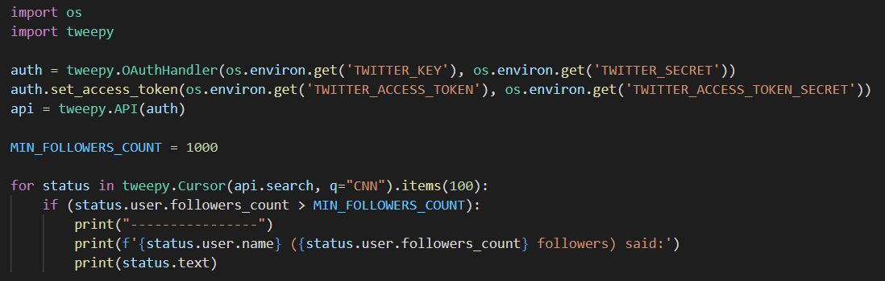

Eventually, I could manually label some datapoints as well, to get the full experience™ of making a dataset.

* Processing a dataset, specifically with my work in NLP preprocessing ([Sentiment 140 Dataset Preprocessing](https://github.com/willwin4sure/CSC_630_Machine_Learning/blob/main/BERT/sentiment140_dataset.ipynb) and [Data Pre-Processing for Predicting Myers Briggs Types](https://github.com/bharnav/CSC630-Machine-Learning/blob/main/Predicting%20Myers%20Briggs%20Types/data%20pre-processing/data_pre_processing.ipynb)), as well as working with the Boston Housing Dataset in [The Pydata Stack Lab](https://github.com/willwin4sure/CSC_630_Machine_Learning/blob/main/pyData/PyData_Stack_Lab.ipynb).

I've already discussed the organization, clarity, analysis, documentation, and improvement aspects in the previous Learning Objective, and much of that carries over for my work in the Jupyter notebooks here. Specific to this Learning Objective, I'll reflect more on the particular steps taken in the first two notebooks towards making the datasets ready for input into machine learning algorithms. In the [Data Pre-Processing for Predicting Myers Briggs Types](https://github.com/bharnav/CSC630-Machine-Learning/blob/main/Predicting%20Myers%20Briggs%20Types/data%20pre-processing/data_pre_processing.ipynb) Jupyter notebook, for example, we explain how and why we will filter out substrings of personality types, links and special characters (using `re`), and splitting the text into particular user's posts:

    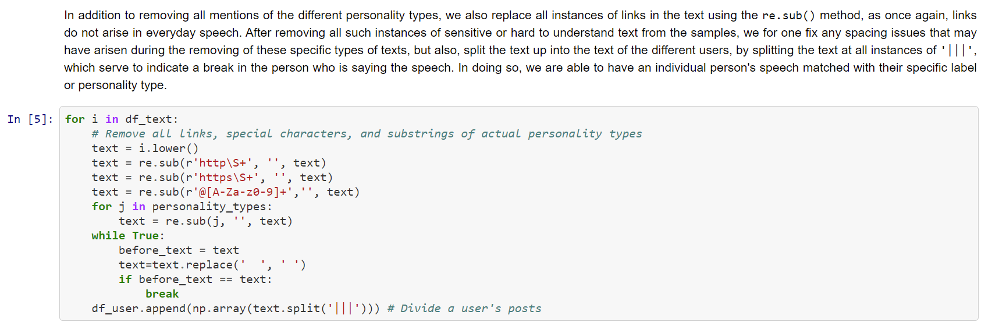

Similarly, in the [Sentiment 140 Dataset Preprocessing](https://github.com/willwin4sure/CSC_630_Machine_Learning/blob/main/BERT/sentiment140_dataset.ipynb) Jupyter notebook, I do similar filtering of starting tags and also work with regular expressions. The image below also shows my progression from manually using Python and `for` loops to filter to learning about regular expressions and using them (with cited help from https://www.kaggle.com/nitin194/twitter-sentiment-analysis-word2vec-doc2vec).

    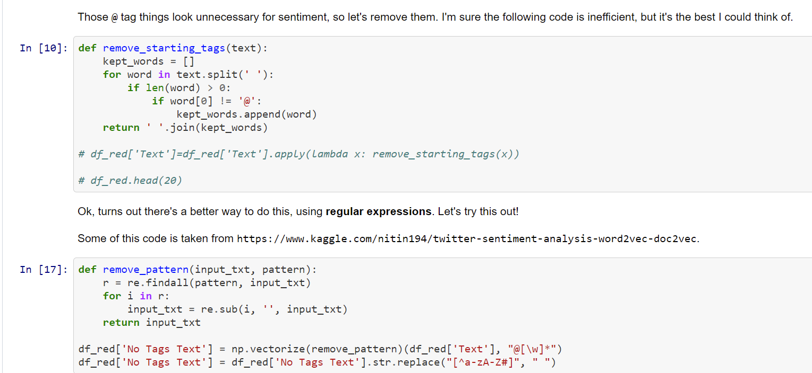

* Creating a Variable class for evaluation and gradient computation that expose how machine learning models work "under the hood." Also, understanding the concept of a computational graph.

Through the [Gradients Project](https://github.com/willwin4sure/CSC_630_Machine_Learning/tree/main/Gradients_Project), I have learned a lot about the how machine learning models work "under the hood." Through the process of implementing the `Variable` class in [`variable.py`](https://github.com/willwin4sure/CSC_630_Machine_Learning/blob/main/Gradients_Project/variable.py) and from lectures in class, I've learned about computational graphs and how to systematically evaluate and take multidimensional gradients of expressions. By putting this theory into practice successfully, I've proven that I have a deep understanding of these concepts.

I have demonstrated a conceptual understanding of gradients and related concepts like contour plots through my work in my gradients project [Jupyter notebook](https://github.com/willwin4sure/CSC_630_Machine_Learning/blob/main/Gradients_Project/project_gradients.ipynb) (I have also taken MTH 650 before, so understanding gradients wasn't too tricky for me). For example, I am able to explain the concept of meshgrids quite well in the Gradients and Contour Plots section:

    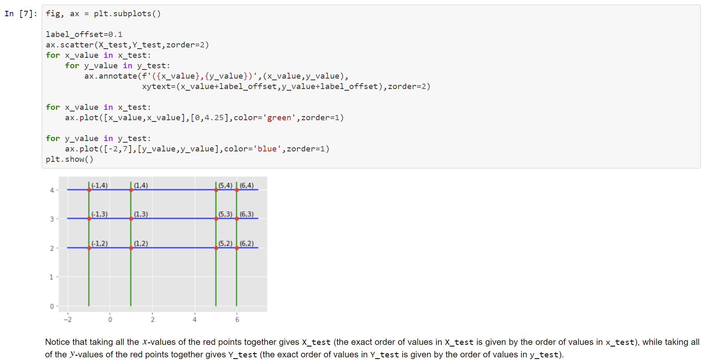

This Jupyter notebook is also well-marked and should show several good test code examples for this [`variable.py`](https://github.com/willwin4sure/CSC_630_Machine_Learning/blob/main/Gradients_Project/variable.py) file. For example, I used a `np.meshgrid` and `plt.contour` to great the following picture, which has several gradients drawn on it programmatically (meaning, I only gave it my expression and then told the code to take the gradients at these points by itself, using the `Variable` class).

    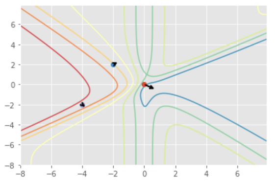

My code in the [`variable.py`](https://github.com/willwin4sure/CSC_630_Machine_Learning/blob/main/Gradients_Project/variable.py) file generally clean, clear, and readable, and I'm proud of several of my optimizations in getting functions "for free" from other functions. For example, in [line 56](https://github.com/willwin4sure/CSC_630_Machine_Learning/blob/main/Gradients_Project/variable.py#L56) for the magic method `__pow__` between two variables, I can simply leverage the power of the `Variable.exp` and `Variable.log` static methods I had already programmed below in order to write it in one line as `return Variable.exp(other * Variable.log(self))`, without having to resort to hard coding some logarithmic differentiation. Similar optimizations where I get functions "for free" occur in `__sub__` (where I combine addition and multiplication by -1) and `__truediv__` (where I combine multiplication and exponentiation to the -1th power).

    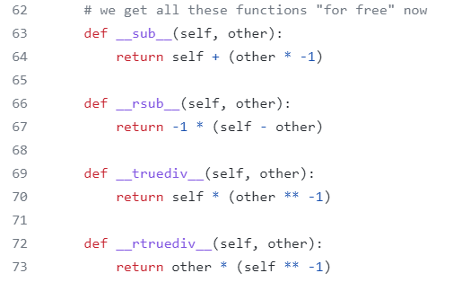

I've also been working on adding docstrings to this file, and have already added a lot of comments for explanation and readability. I also glanced through some of the sources linked in the Jupyter notebook, but only after finishing most of the code, since I enjoyed working through the puzzle of understanding the code and what it's supposed to do (there were a couple points where I got super confused, but after thinking for a bit it just clicked). I loved the progression of having no idea what the minimal working example code was doing to fully grasping how the code recurses and works (the amount of different functions floating around is quite confusing).

I also leveraged the human resources around me, writing some of the code with *Nathan Xiong* and also discussing potential optimizations with *Ali Yang*, *Davin Jeong*, and *Michael Huang*. For example, Davin and Michael both thought about ways to not carry the `values` dictionary around throughout the entire process, and Ali created the API using her own method which had cleaner syntax, raised errors, and checked for circular definitions. I thought both of these ideas were really cool and interesting, though I did like the simplicity of the given approach and opted for it since it felt cleaner to me.

During class time, I would also ask many insightful questions during class, for example "what would `3+x` do, in the context of the Variable class," leading to a discussion of the magic method `__radd__`. 

* Creating a working Logistic Regression class that can fit a logistic curve to an arbitrarily multidimensional dataset. Alos, understanding the concepts of gradient descent and linear classifiers as well as surrounding theory.

I greatly enjoyed putting the `Variable` class to practice in my `Logistic_Regression` class in my [`logistic_regression.py`](https://github.com/willwin4sure/CSC_630_Machine_Learning/blob/main/Gradients_Project/logistic_regression.py) file. I do think too often we use black-box or otherwise pre-existing models without too much thought into what the computer is actually doing, so it was really fun getting a taste of coding, essentially from scratch, both the `Variable` class for taking gradients and actual gradient descent algorithm present in logistic regression.

My code also demonstrates an understanding of cross entropy loss, a concept covered in class, as I'm able to successfully implement it in [line 22](https://github.com/willwin4sure/CSC_630_Machine_Learning/blob/main/Gradients_Project/logistic_regression.py#L22). In [lines 34-37](https://github.com/willwin4sure/CSC_630_Machine_Learning/blob/main/Gradients_Project/logistic_regression.py#L34), I also manage to take the gradient for this value and step in the opposite direction of the gradient, demonstrating an understanding of the process of gradient descent and how it tries to minimize the loss function. 

Overall, I'm proud of creating this multidimensional logistic regression model, and am glad that it worked in some test cases I threw at it in my gradients project [Jupyter notebook](https://github.com/willwin4sure/CSC_630_Machine_Learning/blob/main/Gradients_Project/project_gradients.ipynb). For a 1-dimensional model, I had it print out the loss every 1000 iterations, and then visualized the resultant logistic curve using `matplotlib.pyplot`:

    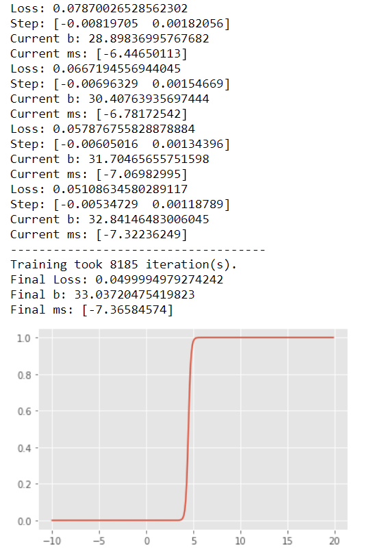

I also recognize, through my function `prediction_cutoff` in this Jupyter notebook, that the output of logistic regression as a real number between 0 and 1 must be interpreted using some cutoff to an actual prediction of 0 or 1, and that this cutoff could be adjusted.

I've done a lot of work in the data modeling process, especially keeping in mind that our class is only at the midterm. At a conceptual level, I have a good idea of what data and datasets are, what loss functions are, what gradients are, how gradient descent works, how logistic regression works, and how more complicated models function. I also enjoyed getting more hands-on in actually programming a `Variable` and `Logistic_Regression` class from scratch in the [Gradients Project](https://github.com/willwin4sure/CSC_630_Machine_Learning/tree/main/Gradients_Project), and believe that my work is organized, concise, and well-documented. Before the end of the term, however, I hope to explore more complicated models and understand them well. I also think I could spend a bit more time exploring and citing external online sources about data modeling.

* **Total:** 11.8/12

## Learning Objective 3: I can use ethical reasoning to empower my data decisions, ensuring that the technical work that I do promotes equity and justice.

* **Organization:** 2.8/3
* **Volume of Work:** 1.9/3
* **Analysis/Documentation:** 2.6/3
* **Progress** 2.8/3

This is likely the weakest learning objective area for me so far, though I do believe I have still done a reasonable amount of work. 

My main work is reflecting on ethical problems within the **Boston Housing Dataset**. First, I gave an analysis on what I learned from this [article](https://medium.com/@docintangible/racist-data-destruction-113e3eff54a8) in [The PyData Stack Lab](https://github.com/willwin4sure/CSC_630_Machine_Learning/blob/main/pyData/PyData_Stack_Lab.ipynb), as below:

    

In addition, I thought a bit more about the Boston Housing Dataset for a homework assignment and wrote up my thoughts in a [Reflection on Boston Housing Dataset Ethics](https://github.com/willwin4sure/CSC_630_Machine_Learning/blob/main/pyData/Boston_Housing_Reflection.md). My ultimate conclusion is that this dataset should *not* be used, mainly due to the **non-invertible** function that was applied to the variable representing *Black proportion of the population*. I do not have gripes with having a column of data about black proportion of the population (even if it feels a bit uncomfortable), since finding potentially discriminatory practices or systemic imbalances across populations could be useful. The data destruction that could potentially support a conclusion (e.g. that racial self-segregation is good), however, makes the dataset unusable, and I don't think it should be used frivolously when there are so many other reasonable toy datasets to use. It should only be used as a learning tool when analyzing ethical issues within datasets.

Aside from the Boston Housing Dataset, I also analyzed the ethics of black box algorithms as part of the [Gradients Project](https://github.com/willwin4sure/CSC_630_Machine_Learning/tree/main/Gradients_Project), particularly in this [Jupyter notebook](https://github.com/willwin4sure/CSC_630_Machine_Learning/blob/main/Gradients_Project/project_gradients.ipynb): 

    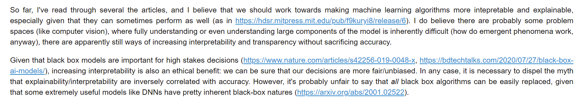

Overall, I'd say my writing is pretty well organized and documented, and I provide good analyses. I've also leveraged online resources when it comes to researching about ethical issues, as well as the students around me (I've talked to people like *Arnav Bhakta* and *Carissa Yip* about these sorts of things, including an idea about [Facebook and other recognition software mislabelling Black people as monkeys](https://www.nytimes.com/2021/09/03/technology/facebook-ai-race-primates.html)). However, my overall volume of work for this learning objective is quite low. I hope to do have more time in the rest of the term to explore and analyze more ethical problems within the field of machine learning (such as the video software recognition system above being discriminatory/racist, and related topics). 

* **Total:** 10.1/12

## Learning Objective 4: I can tell stories with data, both by discussing my process in shaping/manipulating/modeling it and the choices made to do so, and through making arguments about what my findings say about the world.

* **Organization:** 3.0/3
* **Volume of Work:** 2.8/3
* **Analysis/Documentation:** 2.8/3
* **Progress** 3.0/3

Most of my storytelling occurs in the following three Jupyter notebooks:
* [The Pydata Stack Lab](https://github.com/willwin4sure/CSC_630_Machine_Learning/blob/main/pyData/PyData_Stack_Lab.ipynb)
* [Sentiment 140 Dataset Preprocessing](https://github.com/willwin4sure/CSC_630_Machine_Learning/blob/main/BERT/sentiment140_dataset.ipynb)
* [LSTM Model for Predicting Myers Briggs Personality Types](https://github.com/bharnav/CSC630-Machine-Learning/blob/main/Predicting%20Myers%20Briggs%20Types/models/myers-briggs-data_0-lstm.ipynb), with *Arnav Bhatka*

In [The Pydata Stack Lab](https://github.com/willwin4sure/CSC_630_Machine_Learning/blob/main/pyData/PyData_Stack_Lab.ipynb), I employ ample storytelling. All of my work is surrounded by descriptive Markdown cells that explain why I do what I decide to do, as well as my thought processes surrounding the outputs.

    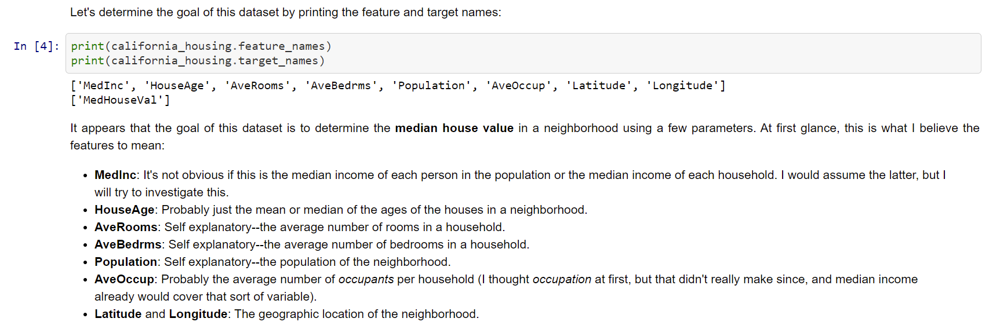

In the above above snippet from the Exploring the California Housing Dataset section, I explain that we are printing out the feature and target names from the dataset, before I offer my input into what these features mean, as well as some writing about what I plan to explore about the dataset in the future. In the snipped below from the same Jupyter notebook, I write down my thought processes about why I would think **AveRooms** and **AveBedrms** as well as how I would test this, followed by my conclusions. 

    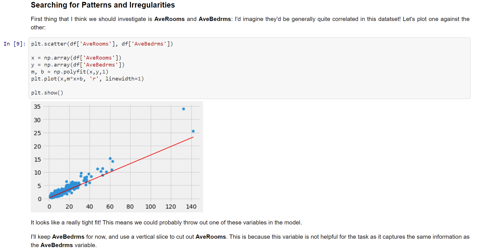

In my [Sentiment 140 Dataset Preprocessing](https://github.com/willwin4sure/CSC_630_Machine_Learning/blob/main/BERT/sentiment140_dataset.ipynb) Jupyter notebook, I weave my code cells with interesting commentary in Markdown cells. For example, in the pair of screenshots below, I write about exploring the dates from which the tweets in the Sentiment140 dataset are from, first discovering that they're all in the same year before checking the months and dates and plotting a histogram of them.

    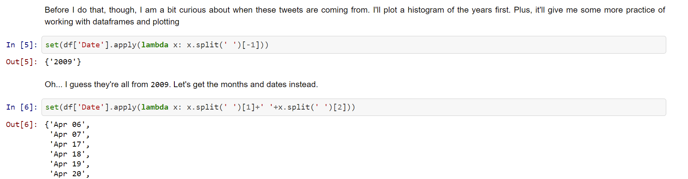

    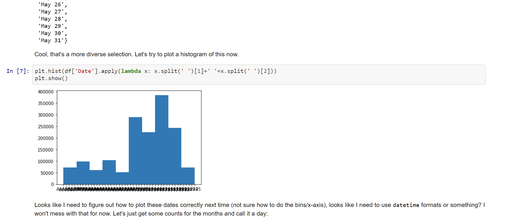

Another example of my uses of story telling are in my LSTM Jupyter notebook that I worked on with *Arnav Bhakta*: [LSTM Model for Predicting Myers Briggs Personality Types](https://github.com/bharnav/CSC630-Machine-Learning/blob/main/Predicting%20Myers%20Briggs%20Types/mod`els/myers-briggs-data_0-lstm.ipynb). Throughout this Jupyter notebooks, all the code cells are surrounded with quite detailed explanations of our process. For example, we wrote a lot explaining the Bidirectional LSTM model:

    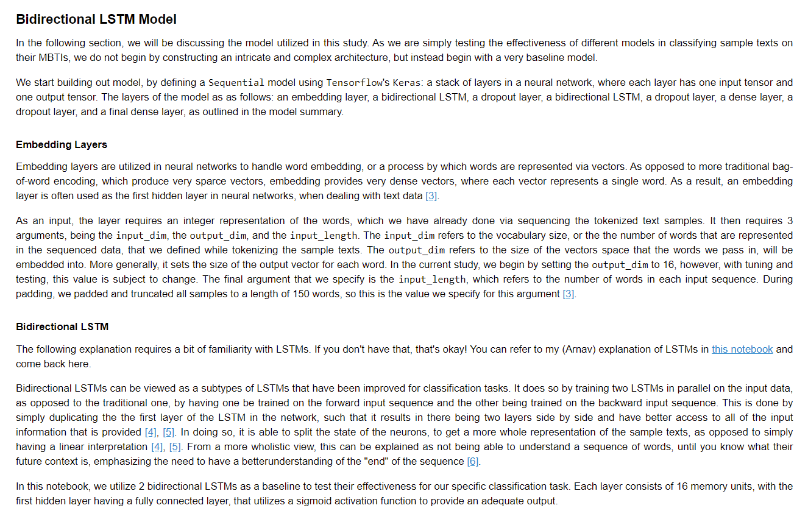

    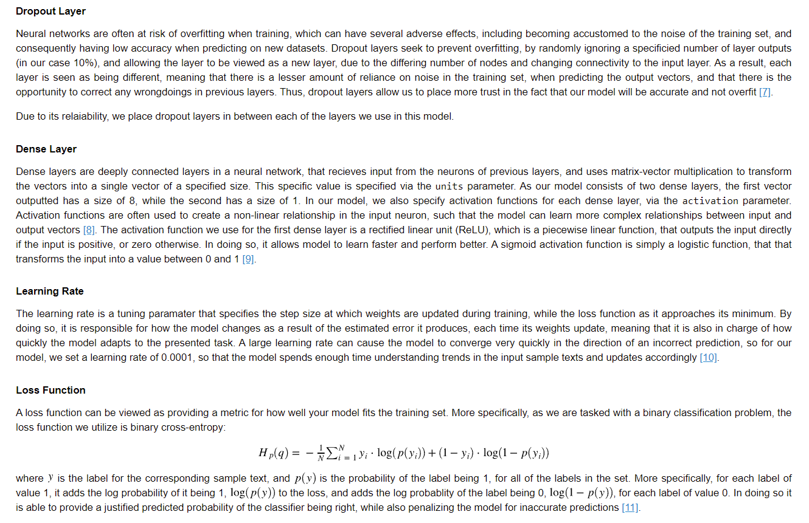

From looking through these Jupyter notebooks, my storytelling work is quite organized through Markdown files and `matplotlib.pyplot` or `sns` plots. It has progressed well throughout the year, and I regularly ask my friends for help (e.g. I worked with *Arnav Bhakta* on two of the above notebooks), and I also reference online sources in my work (e.g. look for citations in [LSTM Model for Predicting Myers Briggs Personality Types](https://github.com/bharnav/CSC630-Machine-Learning/blob/main/Predicting%20Myers%20Briggs%20Types/models/myers-briggs-data_0-lstm.ipynb)).

Overall, I think I've done a substantial amount of storytelling, especially since we're only at the midterm. I hope I can work to craft grander/more wide and insightful narratives about datasets I analyze, in order to make more statements about what my data says about the world in general; I think it's reasonable, however, that more of this work could be done in the future, when we can also analyze our datasets using models themselves. I also think some of my explanations and documentation could be cleaner to fit such stories or claims.

* **Total:** 11.6/12

## Overall Grade
`(12+11.8+10.1+11.6)/48=45.5/48=94.8%`

## Additional Reflection

* Is the course more or less what you expected before taking it? If not, what is noticeably different from your initial expectations?

The course is quite different than what I expected, though I'm enjoying the current strucutre. For example, I would've imagined more lecture-style lessons on Python for the first few weeks of the class, though I realize that this isn't very efficient since different people in the class have very varying familiarities with Python. I also didn't expect we'd be doing low-level "under the hood" work like in the `Variable` and `LogisticRegression` classes, though I'm really enjoying it and finding it quite interesting, since we get more of an idea of what models are actually doing.

* What challenges have you faced in dealing with the sometimes daunting amount of material we've been learning? I haven't given you explicit instructions for how to, for example, take notes, save/organize sample code snippets, research additional sources of explanations/examples for topics, or test out your thinking in your own code. How have you been faring in these "being a student" tasks, and how might you improve at them as the course continues?

Time management has been a bit of a challenge as we've had to adjust to the old schedule with 3 class periods per class a week again. It was pretty hard learning all of the aspects of Python that I didn't know before within the first two weeks of class, and especially for this midterm reflection, I've spend multiple long nights working on it. However, I do feel like my Python, pyData stack, Jupyter notebook, and other skills have improved greatly. I have a pretty organized system for saving and organizing my code in my Github repository, I often search up problems I encounter on Google and use resources like blogs or Stack Overflow, and I also talk to my friends in CSC 630 if I need help or want to otherwise discuss the test. I am getting more accustomed to the workflow now and will continue to improve.

* We discussed at the beginning of the term that all of this material is freely available online, and so the only "real" reason we have for doing this work here is (that it's organized into assignments, and) the community of learners around you, and my role as your teacher. How have you leveraged these human resources, for better or worse thus far, and how do you hope to improve upon this as the course continues?

I've been leveraging my resources pretty well: I talk to my friends also in CSC 630 like *Davin Jeong*, *Ali Yang*, *Arnav Bhakta*, and *Michael Huang* to work together on projects or code homework. I also often ask Dr. Z questions during class or conference period. In the future, I hope to meet more of the people in my class and also take on more long-form challenging projects.

* What are your initial thoughts about how you'd like to spend the rest of the term, post Gradients Project? This is highly non-binding, but I just want you to do some brainstorming at this point. Some examples include:
    * Learning about particular types of machine learning models, such as clustering algorithms, decision trees (and the forests that they aggregate into), support vector machines, or various types of neural networks.
    * Learning about particular problem spaces, such as image classification, natural language processing, or data modeling from a particular field (medical, financial/economical, educational, ecological [or other scientific], *etc.*).
    * Learning particular tool sets, like PyTorch/Theano/Tensorflow, Scikit-learn, numpy/linear algebra, *etc.*
    * Researching and writing on particular ethical issues in the field of AI, informed by your technical knowledge. For example, bias against people of color in data sets translating to machine learning models being biased (or even racist).
    * Analyzing deeply a particular data set (including possibly one you haven't collected yet).

    Obviously, doing any one of these necessitates doing some of the others as well, but having a focusing idea can really help you have a sense of where you want to take the second half of the term. Which of these feels most important to you?

Many projects! I'm interesting in adversarial machine learning, creating a Tetris bot, maybe creating a Chess engine, analyzing the ethics of potentially racist computer recognition software, computer vision, NLP, and more! I also want to learn how things like PyTorch work.

The things that I will focus on are probably NLP, Tetris, and ethics of computer vision.